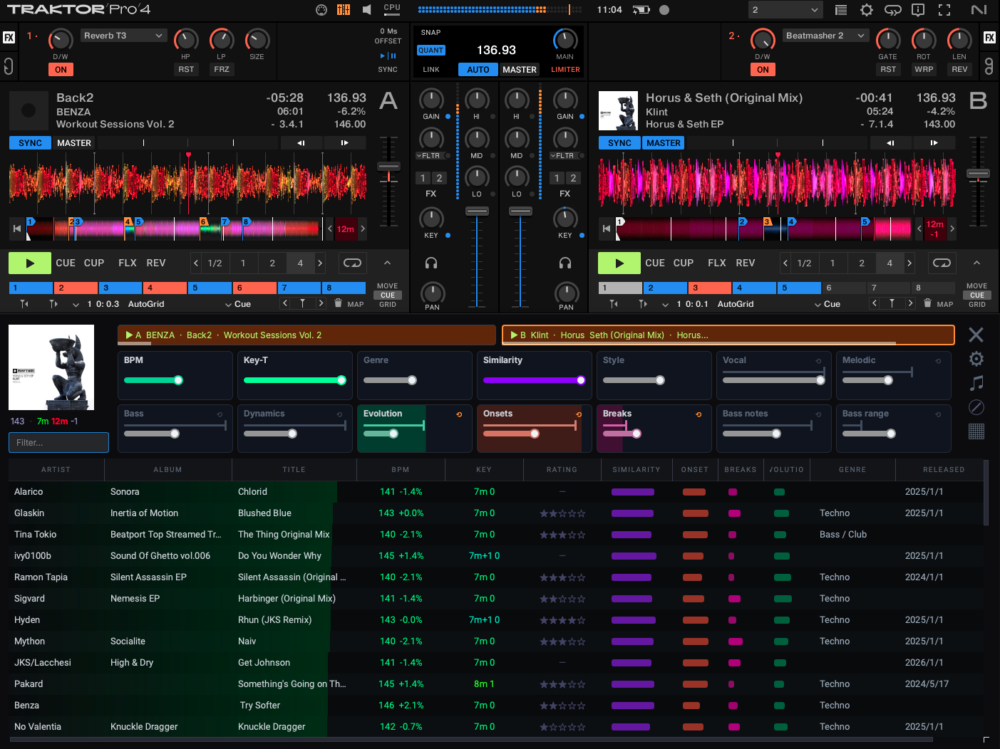

<!--
  This file is the public README. The release workflow publishes it as
  README.md of github.com/hdavid/Track-Kommander, together with LICENSE,
  THIRD_PARTY.md, licenses/, docs/ and the FFmpeg LGPL build scripts.
  Edit it here, in the private repo - the public repo is overwritten on
  every release and never edited by hand.
-->
# Track Kommander

**A companion for Traktor Pro 3 / 4**

**Find the next track.** It analyses your library, watches what is playing,
and puts the tracks that actually fit the current deck in front of you — then
loads the one you pick, with the transition already set up.

**Take that library to the club.** It writes a USB stick CDJs read on their
own — beat grids, hotcues, waveforms, playlists — straight from your Traktor
collection. No Rekordbox in the middle, no re-analysing everything in someone
else's software.

Runs on macOS and Windows, beside Traktor, on your own machine. Nothing is
uploaded anywhere.



---

## What it does

### Finding the next track

* **Analyses your collection** — BPM, musical key, and a set of perceptual
  features (energy, mood, vocal/instrumental, style) from
  [CLAP](https://huggingface.co/laion/clap-htsat-fused), an audio model that
  runs locally. Your files never leave the machine.
* **Watches the deck** — a small QML bridge inside Traktor reports what is
  playing, which deck is on air, and where the faders are.
* **Ranks the rest of your library against it** on the axes you care about:
  tempo, harmonic compatibility, energy, style, bassline and structure, and
  whatever else you weight in **Settings → Matching**.
* **Finds tracks that fit once transposed** — a semitone or three on Traktor's
  Key knob opens up matches the wheel alone would never offer. The shift is
  shown beside the key, and set on the deck when you load.
* **Loads the track you choose** onto any deck, by synthesizing a real drag or
  by driving Traktor's browser — and then, optionally, silences the channel,
  switches the headphone cue, beat-syncs, plays, and ramps the fader back up.
* **Auto DJ** — does all of that by itself before the current track runs out.
* **Drives from an S4 MK2** — the browse encoder and the CH1–CH4 CUE buttons
  navigate and load, so you never touch the laptop. Every control is
  rebindable in **Settings → Controls**.
* **Shows you your library** — feature distributions, spread and correlations
  across everything you have analysed (⌘⇧S / Ctrl+Shift+S).

### Taking it to the club

* **A USB stick a player reads on its own** — `PIONEER/export.pdb` and the
  per-track `.DAT`/`.EXT` analysis, written directly from `collection.nml`.
  Rekordbox is not needed to produce it and does not have to be installed.
* **Your Traktor work travels with it** — beat grids, hotcues and loops, BPM,
  musical key, ratings, and your playlists (smart ones evaluated at export
  time).
* **The stick also carries a `rekordbox.xml`**, so the same export can be
  imported into Rekordbox if you would rather go that way.
* **Add or replace**, resumable, with progress and time remaining for every
  phase. Stopping leaves a stick that still plays; running it again adds the
  rest and re-decodes nothing.
* Audio is filed by artist and album and folded to ASCII, which is what older
  players expect.

> **Not yet confirmed on real hardware.** Every byte matches what Rekordbox
> writes wherever that could be checked, and Rekordbox itself accepts the
> analysis — necessary, but not the same as a CDJ loading it. Use a spare stick
> until you have tried one. Details in
> [docs/rekordbox-export.md](docs/rekordbox-export.md).

### Housekeeping

* **Detects missing hotcues** across the collection and writes them back into
  `collection.nml` (with a backup).
* **Fixes wrong beat grids from the mix.** Nudge a track into place by ear,
  right-click the deck, and the offset Traktor's phase meter is showing is
  queued — written to the grid marker later, when Traktor is closed.

---

## Install

Download the latest build from
[Releases](https://github.com/hdavid/Track-Kommander/releases):

| | |
|---|---|
| **macOS** | `Track Kommander.dmg` — signed and notarized. Drag to Applications. |
| **Windows** | `TrackKommanderSetup.msi` — a normal Next/Next/Install wizard. |

Roughly 300 MB to download and 700 MB installed: most of that is the audio
model, which ships inside the app. There is **no separate model download on
first run**.

### What you need

| | |
|---|---|
| **OS** | macOS 13 or newer, or Windows 10/11 (64-bit). |
| **Traktor** | Traktor Pro 4 or 3, installed and set up. |
| **Disk** | ~1 GB for the app, plus a few hundred MB of analysis database for a large library. |
| **Hardware** | Optional. A Kontrol S4 MK2 can drive the matcher. |

---

## First run

Only step 1 is needed to export to a USB stick: that reads `collection.nml`
and your audio files and nothing else — no scan, no bridge, no permissions.
Steps 2 to 5 are for the matcher, which has to analyse the library and drive
Traktor.

1. **Point it at your collection.** It looks for Traktor's `collection.nml`
   in the usual place; if you keep several, pick one in **Settings**.
2. **Scan the library** — **Library → Scan**. Analysis is incremental and
   runs in the background; a large collection takes a while the first time and
   nothing afterwards.
3. **macOS permissions.** When prompted, or in **System Settings → Privacy &
   Security**, enable:
   * **Accessibility** — to type into Traktor's search field and to simulate
     the drag onto a deck.
   * **Screen Recording** — for *Calibrate from screenshot*, which captures
     the Traktor window so you can click each deck's drop zone.

   The Settings tab shows live status for both.
4. **Install the Traktor bridge** (recommended). Without it, Track Kommander
   can still load tracks, but it cannot see deck state and cannot run the
   post-load automation. Quit Traktor, then **Settings → Traktor → Install
   into Traktor…**. It backs Traktor's D2 folder up, verifies the copy, and
   only then adds its own module — nothing Native Instruments ships is
   replaced, so a real Kontrol D2 keeps working. **Restore** undoes it.

   You do not have to take the backup on trust: Traktor's own files are
   archived as `original-files.zip` and left in the folder that was changed,
   so you can open it and see exactly what was there before.
   `Traktor/D2/INSTALL.txt` is the manual fallback if that fails.

   Traktor loads the mapping only when a **Kontrol D2** is present in
   Preferences → Controller Manager (the hardware itself is not required).
   Traktor reads the mapping once, at startup, so restart it after installing.

   > Installing the bridge writes into Traktor's own application folder. The
   > originals are backed up first and can be restored from the app. On macOS
   > that means writing inside a code-signed bundle, which invalidates
   > Traktor's signature — Traktor runs fine afterwards, but you should know
   > it is happening before you agree to the prompt.

5. **Calibrate the deck drop zones**, once per Traktor layout: **Settings →
   Calibrate from screenshot**, then click each of the four deck drop zones
   (A, B, C, D) and press Enter. The clicks are stored relative to the Traktor
   window, so they survive it being moved or resized.

---

## Matching and loading

### Loading a track

Right-click a result row → **Load into Deck A/B/C/D**, or use the S4 MK2's
load buttons. Two delivery methods, in **Settings → Load method**:

* **Drag & Drop** *(default)* — synthesizes a real drag from the result row
  onto the deck. Fast, accurate, no search ambiguity.
* **Search + QML** — types the path into Traktor's browser and asks the bridge
  to load the top result.

With automation on it always uses the QML path, because that is what makes the
post-load steps fire.

### Automation modes

Cycle the automation button at the top of the Now Playing tab:

| Mode | What happens after a load |
|---|---|
| Off | Nothing — just loads the track. |
| Play + Cue | Silence the channel fader, switch the headphone cue, beat-sync, play. |
| AutoMix | The above, plus a volume ramp over the configured number of bars. |
| Auto DJ | Picks and loads the next match before the current track ends, then runs the full transition. |

### Other things worth knowing

* Double-click the album-art icon to snap the window over Traktor's browser
  area; double-click again to restore.
* **Settings → Traktor → Turn Sync on for every deck** — Traktor has no "sync
  all" switch, so Track Kommander presses it on A–D when the bridge connects
  and after every load.
* **Library → Hotcues → Detect Hotcues** — finds tracks that have a beat grid
  but no cues and writes cues for them. Close Traktor first; a `.bak` is
  written automatically.
* **Fix phase** (right-click a deck) — with the tempos locked, whatever the
  phase meter still shows after you have nudged a track into place is the
  error in its beat grid. The menu names it in milliseconds and in beats, and
  queues it; **Library → Hotcues → Beat grid fixes** applies them one at a
  time or all at once, once Traktor is closed.
* **Settings → Controls** — rebind every keyboard shortcut and every S4
  control, including the keys forwarded through to Traktor.

---

## Exporting to Rekordbox and CDJs

**Library → Rekordbox.** Tick the playlists you want — ticking nothing exports
the whole collection — choose the drive, and **Export to USB…**. The
destination and your selection are remembered, so the next export is a couple
of clicks.

What lands on the stick:

```
Contents/<artist>/<album>/<audio>          the files themselves
PIONEER/rekordbox/export.pdb               the track and playlist database
PIONEER/USBANLZ/…/ANLZ0000.DAT             beat grid, cues A–C, waveform
                 /ANLZ0000.EXT             cues D–H, colour waveform
PLAYLISTS/<name>.m3u8                      plain playlists, for everything else
rekordbox.xml                              for importing into Rekordbox
```

Worth knowing:

* **Add or replace.** *Add* merges: what is already there stays, a track
  exported again is refreshed, a playlist of the same name is replaced.
  *Replace* rebuilds the stick from scratch and **deletes** audio that is no
  longer listed — the confirmation tells you how many tracks and how many GB
  before anything happens.
* **Stop is safe.** It finishes the track being written. What is on the stick
  stays playable, and running the export again picks up where it left off
  without decoding anything twice.
* **Eject properly.** The database is written last and has to be flushed.
* **Timing offset.** Traktor and Rekordbox do not always agree on where t=0
  sits in an MP3, so grids can land a few ms apart. Export, check one track,
  adjust if needed.

> **The player side has not been confirmed on real hardware yet.** Use a spare
> stick until you have tried one on a CDJ.

[docs/rekordbox-export.md](docs/rekordbox-export.md) has the full account —
what is written for which players (both `export.pdb` and the OneLibrary
`exportLibrary.db` the 2023+ players require), what is deliberately not
(`PSSI` phrase data, so the CDJ-3000 phrase view will be empty), and how the
blank database template is generated.

---


## Troubleshooting

* **"Drag falls back to search"** — the log shows `drag_to_deck: rejecting
  drag` with a non-Traktor owner at the destination. Re-run **Calibrate from
  screenshot**; stale calibration is discarded automatically once it falls
  outside Traktor's current bounds.
* **Automation does not fire** — check that Settings → Automation is not
  "Off", and that the Traktor connection indicator is green (bridge installed,
  Traktor running).
* **Logs**
  * macOS: `~/Library/Application Support/Track Kommander/logs/log.log`
    (plus `crash.log` for native crashes)
  * Windows: `%APPDATA%\Track Kommander\logs\log.log`
  * INFO by default. For DEBUG, tick **Settings → General → Verbose
    logging** (takes effect at once) or set `TK_LOG_LEVEL=DEBUG` in the
    environment, which overrides the checkbox.

---

## Contributing

Bug reports and feature requests go to the
[issue tracker](https://github.com/hdavid/Track-Kommander/issues). Please
attach the log (see Troubleshooting) and say which OS and Traktor version
you are on. Track Kommander is distributed as ready-built installers; the
source code is not published here.

---

## Licence and attribution

Track Kommander is **free to use, but not open source**. The installers are
distributed under the terms in [LICENSE](LICENSE): install it on as many of
your own machines as you like and use it for paid gigs, but do not
redistribute, modify or reverse engineer it. Copyright © 2026 Henri David.

It is built on open-source components, which keep their own licences: Qt
(PySide6), FFmpeg, libsndfile and soxr under the LGPL, the rest permissive.
FFmpeg is an audio-only build free of GPL components
(`scripts/build_ffmpeg_lgpl.sh`), and its complete source ships inside the
app. [THIRD_PARTY.md](THIRD_PARTY.md) walks through the whole audit — every
dependency, every licence, and which machine-learning models are bundled and
why the non-commercial ones are not. The full texts ship inside the binaries
under `licenses/`, reachable from **Settings → About**.

### Not affiliated with Native Instruments

Track Kommander is an independent project. It is **not affiliated with,
endorsed by, or sponsored by Native Instruments GmbH**. "Traktor", "Traktor
Pro" and "Traktor Kontrol" are their trademarks, used here only to describe
the software this tool works with. "Rekordbox" and "CDJ" are trademarks of
AlphaTheta Corporation.

No Native Instruments code is included — the QML bridge the app installs was
written for this project against Traktor's public controller API.
